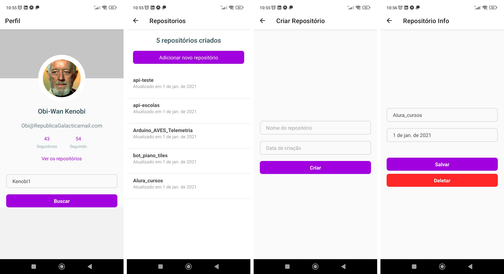

# React Native: utilizando Web API

Esse é um projeto de curso que tem como objetivo ensinar como configurar e utilizar uma Web API no React Native utilizando a biblioteca Axios. Durante as aulas, foram abordados os conceitos básicos de uma Web API e sua importância para o desenvolvimento de aplicações, bem como o uso de uma Fake API para testes iniciais.

1.O que é uma Web API e por que utilizar:
    -Uma Web API é um serviço que conecta um aplicativo a um banco de dados, permitindo fazer requisições para ler, criar, editar e apagar informações.

2.O que é uma Fake API e por que utilizar:
    -Uma Fake API é uma forma utilizada para simular uma Web API real. A grande diferença é que as informações são salvas localmente e as rotas de requisições já são pré-definidas, como o GET, POST, PUT, DELETE e entre outras. Existem maneiras diferentes de fazer uma Fake API e uma delas é usar a biblioteca json-server. Uma Fake API agiliza o processo de simular uma aplicação com uma Web API, facilitando os testes iniciais da criação de um App.

3.O que é o Insomnia e por que utilizar:
    -O Insomnia é muito utilizado por pessoas desenvolvedoras para testar requisições e verificar se uma Web API está funcionando bem. Nele é possível testar todos os tipos de requisições, incluindo o CRUD (criar, ler, atualizar e deletar).

4.O que é o projeto:
    -Nessa aula, entendemos melhor o código do app fornecido para esse curso, passando por cada tela e vendo os códigos nos arquivos.

5.Como configurar uma Web API no React Native:
    -Aprendemos a instalar o Axios e configurá-lo no projeto. Além disso, entendemos o porquê de usar o Axios ao invés do Fetch.

6.Como fazer uma requisição GET:
    -Fizemos a primeira requisição do CRUD, chamada GET, para buscar todas as informações com a Web API.

7.Como fazer requisições GET:
    -Fizemos duas requisições do tipo GET para nossa Web API, uma para buscar um usuário e outra para buscar os repositórios de um usuário.

8.Como realizar requisições PUT:
    -Esse tipo de requisição nos permitiu editar as informações de uns repositórios.

9.Implementar requisições para criar e editar dados:
    -Implementamos mais duas requisições, o POST e o DELETE. Com elas, conseguimos criar e deletar um repositório, respectivamente